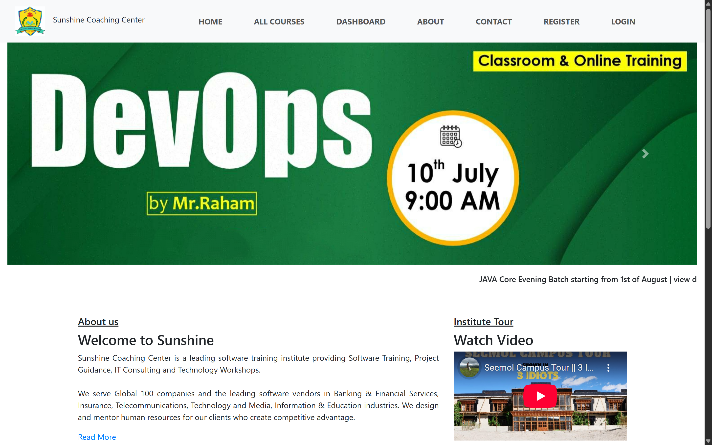
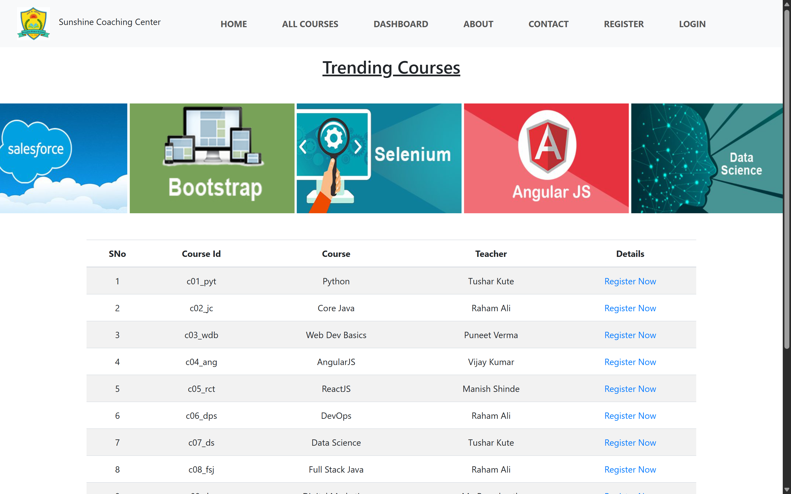
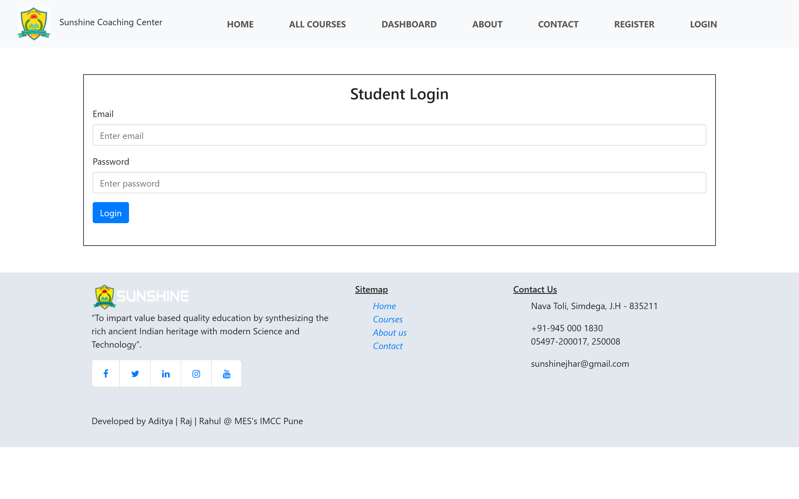
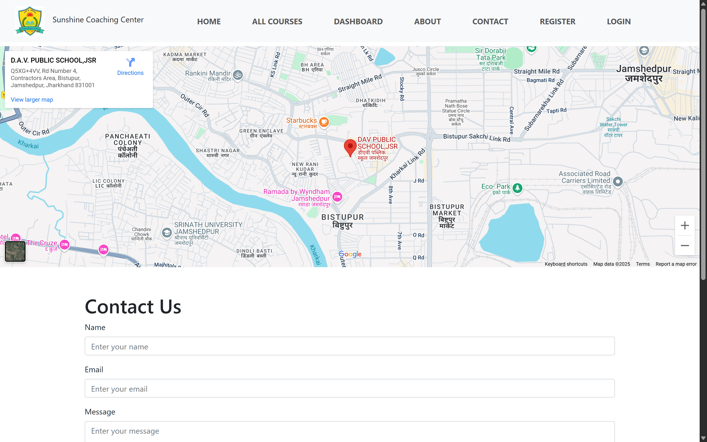
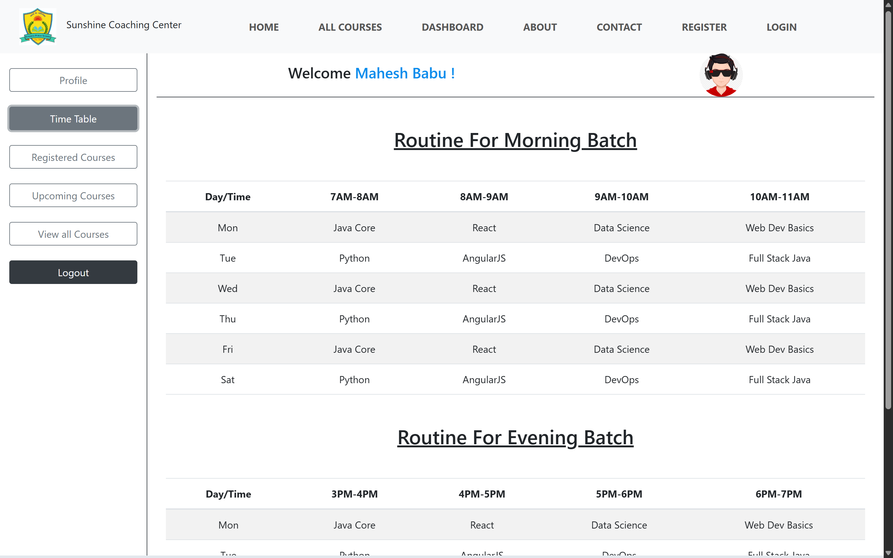

# Sunshine-Coaching-Center

>  A full-stack web application for educational resource management with Flask backend, MySQL database, and responsive frontend design.

## **Technical skills implemented** 

- HTML
- Bootstrap
- JavaScript
- Flask
- MySQL

## Getting Started

Follow these steps to set up and run the project locally.

### 1. Clone the Repository

```bash
git clone https://github.com/rahullkumr/sunshine-coaching-center.git
cd sunshine-coaching-center
```

### 2. Set Up Virtual Environment

#### For Windows:
```bash
python -m venv venv
venv\Scripts\activate
```

#### For macOS/Linux:
```bash
python3 -m venv venv
source venv/bin/activate
```

### 3. Install Dependencies

```bash
pip install -r requirements.txt
```

Make sure you have `requirements.txt` in your project root. 

### 4. Setup MySQL Database

- Step 1: Create the database

    > Login to MySQL and create the `scc` database:

    ```sql
    CREATE DATABASE scc;
    EXIT;
    ```

- Step 2: Import the SQL file

    ```bash
    "C:\Program Files\MySQL\MySQL Server 8.0\bin\mysql.exe" -u root -p scc < "path_of_this_sql_file\scc.sql"
    ```

- ✅ Make sure to adjust the paths.

### 6. Run the Application

```bash
flask run
```

Visit [http://localhost:5000](http://localhost:5000) in your browser.


## Screenshots

 <br><br>
 <br><br>
 <br><br>
 <br><br>


---

## 🙋‍♂️ Author

Rahul Kumar  
Aspiring Full-Stack Developer | Python | Flask | Django | React | MySQL  
[LinkedIn](https://www.linkedin.com/in/rahullkumr) | [GitHub](https://github.com/rahullkumr)
